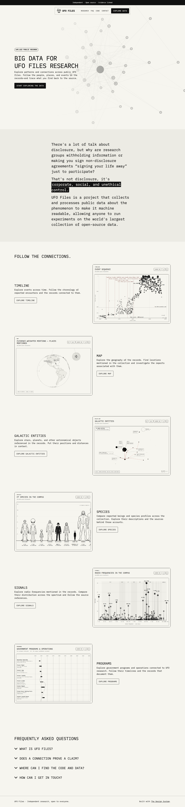

# UFO Files Homepage

The static public entry point for [UFO Files](https://ufo-files.app).



## Design

Based on [Glenn Sorrentino’s original design system](https://github.com/glenn-sorrentino/design-system),
revision `f89ec1a5b233fb94fa4779aa426d928d3f59bfc9`. The original reset,
stylesheet, and bundled template fonts are in `src/`. UFO Files adaptations
live in `styles.css`, mapping the graph app’s paper/ink palette and IBM Plex
Mono regular/bold typography onto the template. Active font files and their
license are in `assets/fonts/`.

The intro background uses node and edge geometry from the existing graph SVG,
with labels removed for a decorative background. The page uses the template’s
island header, intro, statement, feature, and FAQ
structure, with features for Timeline, Map, Galactic Entities, Species, Signals,
and Programs. Feature images come from the research app’s screenshot gallery;
each button opens its corresponding view. Navigation is progressively enhanced for mobile; native disclosure
controls keep the FAQ usable without JavaScript. Research and contact links
continue to open the existing tools.

The intro badge reads the live `counts.documents` total from the graph app’s
published catalog. It requests only the first 16 KiB, cancels the stream once
the count is found, and refreshes each minute while the page is visible.
Failures show “Record count unavailable” and retry automatically.

## Local preview

```sh
python3 -m http.server 8124 --bind 0.0.0.0
```

Then open <http://127.0.0.1:8124>.

## Validation

```sh
npm ci
npm test
node --check script.js
npm run screenshots
```

Before/after desktop and phone captures are in `screenshots/`. The screenshot
command updates the standard images in `assets/`.

GitHub Pages publishes the repository root from `main` to the custom domain in
`CNAME`.
